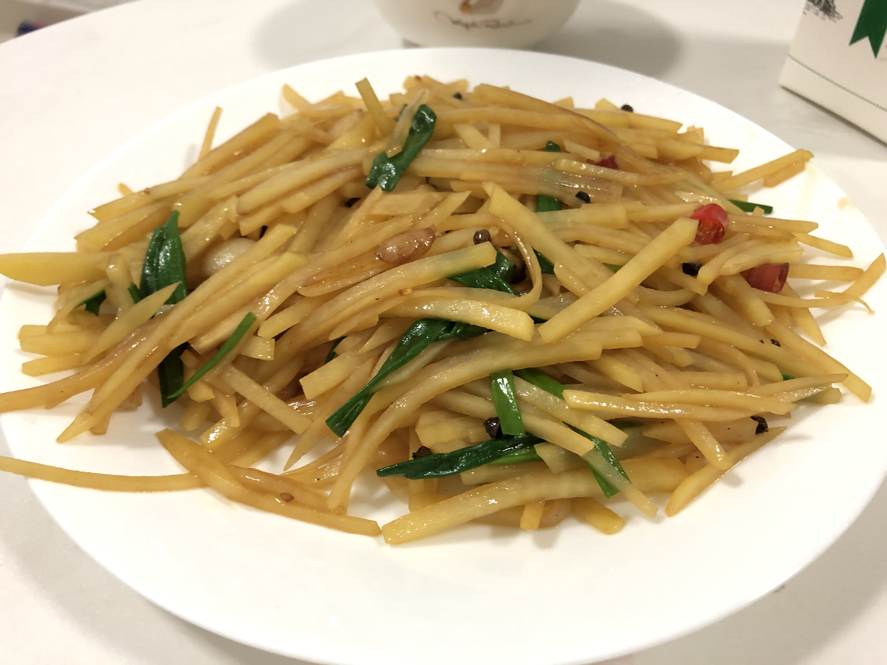

## 土豆丝

### 评级：☆☆☆☆

### 耗时: 

### 时间
2022.01.28 周五 有个发芽的土豆，丢了不能吃
2021.10.29 周五 两盘..还是软的更好吃
2021.09.24 周五 20:44(领证一周年)
2021.09.05 周日
2021.02.06 20:15 周六(我肠胃不舒服蓝莓+牛奶，媳妇辛苦做饭)

### 材料
1. 土豆 2个(宝说盒马的有机土豆好吃，就是有点贵9元)
2. 干辣椒5个（朝天椒2个）青花椒一小把 蒜4瓣
3. 白醋 酱油 糖 盐 鸡精
4. 小葱

### 步骤
1. 热锅冷油，煸香2
2. 倒入土豆丝翻炒
3. 加`半勺盐`、`多半勺酱油`、`半勺醋`
4. 翻炒熟，加葱、`一点鸡精`
5. 出锅

### 关键点
1、3’16‘’（倒入土豆丝开始~出锅停火），稍微有点软，下次试试时间短点  
2、2'30''挺好
3、00:00倒入土豆丝，01:45倒入葱，02:00加鸡精，02:30关火出锅

