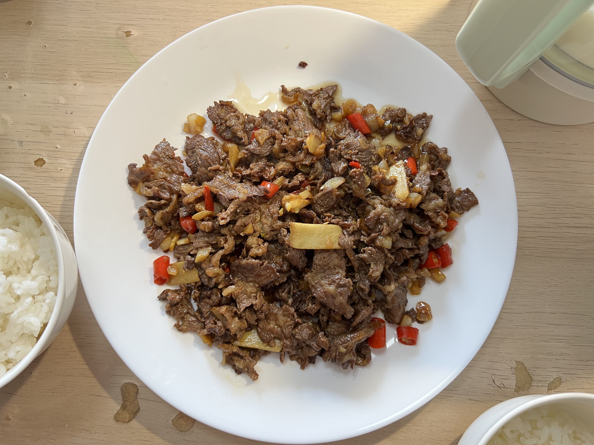

### 耗时: 

### 时间 
2023.2.17

### 材料
1. 雪花牛肉：4两（发哥潮汕大排档）
2. 小米辣：至少4根（我觉得6根好一些，但孕妈觉得已经很辣），切圈，部分切碎试试
3. 蒜：1头，每瓣切3-4块就可以了，不用太碎
4. 姜：几片

### 步骤
腌肉：
1. 料酒、姜、花生油，抓匀腌制

炒：
1. **大火**炒肉，顺锅边儿溜入`料酒`，变色快速捞出，空掉血水汁沫
2. 洗锅，多放点油，油温7成热就后，中小火煸香小米辣、蒜
3. 改大火，放入肉，先快速炒匀，加0.5勺盐、1勺酱油，0.5勺鸡精，炒匀立马出锅（20s不到，讲究的就是猛火、速度，不然就老了）
