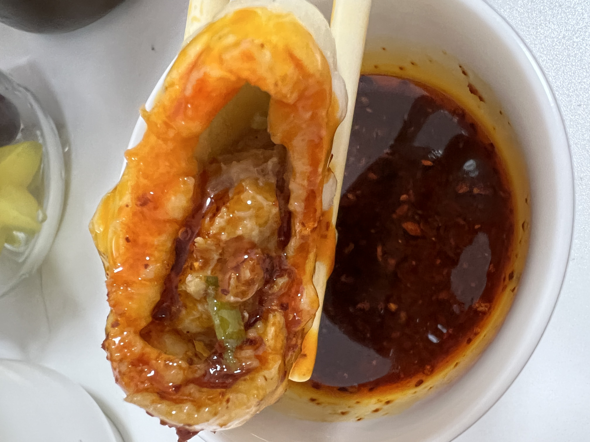

## 小笼包

### 耗时: 2h

### 做了多少次
首次：很久之前了  
最近一次：2022.04.10  
总计：+23

### 材料
1. 猪肉馅250g（盒马的黑猪）
2. 姜5片
3. 大葱100g（没用完，大概80g，主要用葱白，可以少点绿的）
4. 酱油3勺
5. 料酒0.5勺
6. 蚝油0.5勺
7. 鸡精小半勺
8. 十三香一小勺
9. 盐0.5勺
10. 和面：250g高筋面粉，水大概110g，2g酵母，发40min

### 步骤
这些材料对应能做18个包子。

和馅：
1. 肉馅加酱油，和3min，期间加少量生姜水（泡在清水里静止），再加料酒，再和1min，再加少量生姜水。加蚝油、鸡精、十三香，加剩余生姜水。加盐，加0.5勺花生油，加3滴香油提香。最后放葱。

擀面：
1. 搓成均匀长条，然后分成剂子，每个重量19-21g
2. 擀成圆形开始包

蒸：
1. 蒸笼底刷一点点玉米油（小的放5个，大的8个）
2. 将包好的包子放在蒸笼上，**盖盖子**，再发一会儿
3. 凉水开始蒸，中大火烧开后，继续中大火蒸15min即可

### 坑记录
1. 盒马的黑猪肉，东北民猪还可以。但是买平时烧烤买肉品牌的肉馅，这个感觉太实了，一疙瘩比较硬，不好吃。