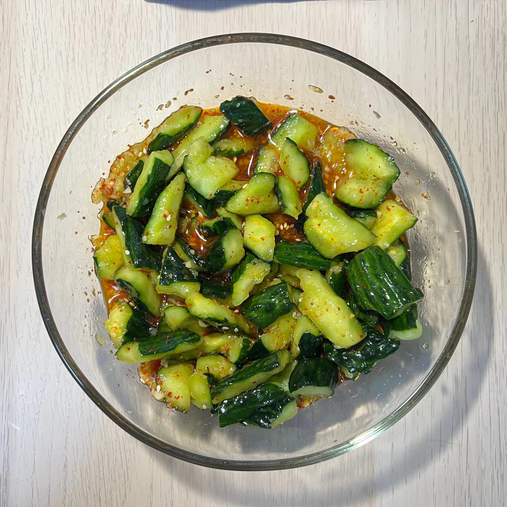

  

### 耗时: 大约30min

### 做了多少次
首次：2022.11.29  
最近一次：2023.1.11  
总计：+3

### 材料
1. 2根黄瓜
2. 3瓣蒜
3. 2勺辣椒面
4. 0.5根小米辣
5. 50粒白芝麻  

### 步骤
1. 2根黄瓜，盐水泡一会儿（大概5-10min就行，讲究的孕妈需要特别卫生），流水下洗搓干净。
2. 黄瓜首尾去掉点儿，用菜刀侧面拍黄瓜，而后可徒手将黄瓜掰成一小段一小段的，放入保鲜袋中。
3. 保鲜袋中加`0.5勺盐`，静置10min，为了让黄瓜尽可能地出水，待会儿要滤掉。
4. 空碗一个，放入以下材料：
   - 小米辣切圆圈；
   - 蒜瓣剥皮剁成蒜末；
   - 辣椒面；
   - 50粒白芝麻；
   
   热油泼上述材料，而后加入：
   - 1勺白糖；
   - 2勺白醋；
   - 0.7勺酱油；

   搅拌均匀，此时汤汁就和好了。
5. 黄瓜过滤掉水分（可以剪掉一个口子放水），倒入碗中搅拌均匀即可。

