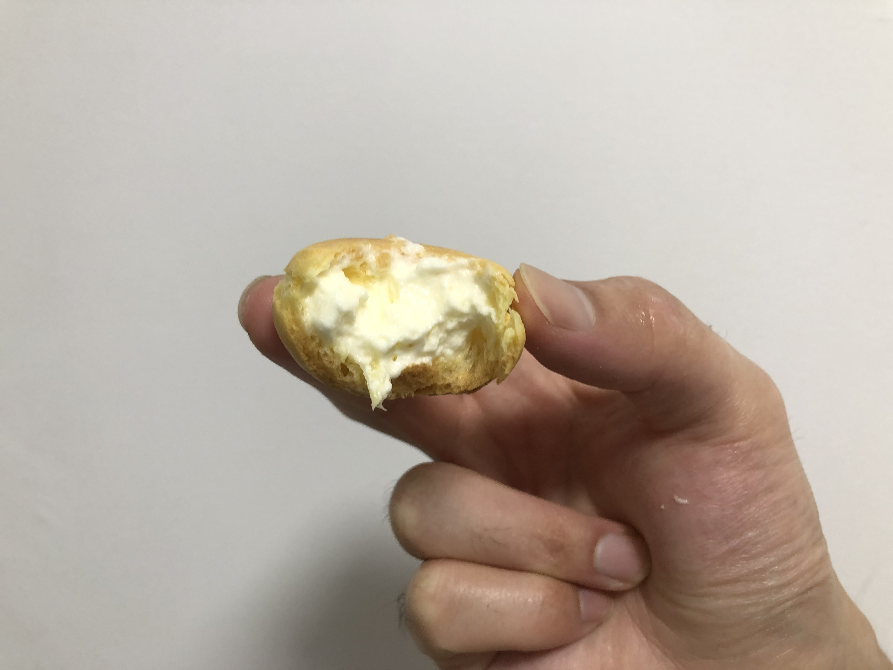
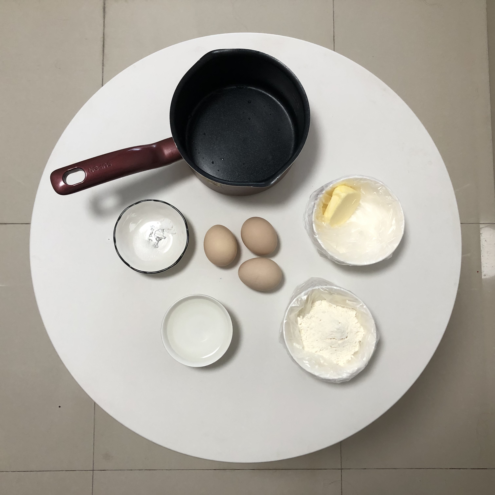
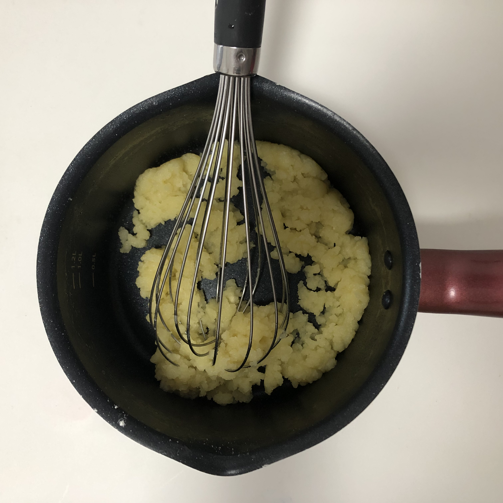
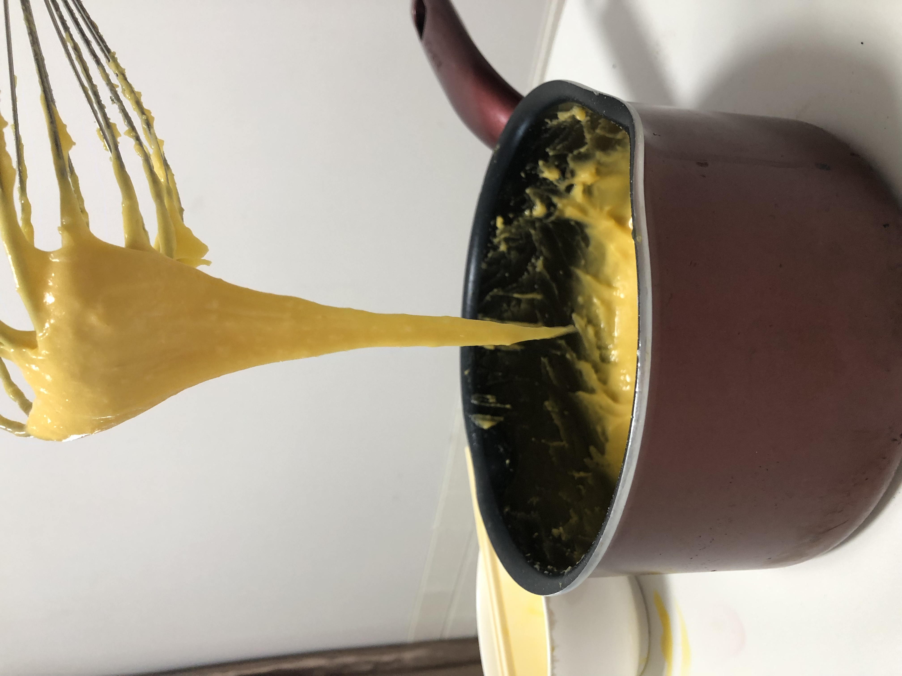

## 泡芙

### 耗时: 1.5h

### 时间
- 2021.10.04 18:45 再来一锅，刚才挤大了，而且上面有点儿焦
- 2021.10.04 16:32 宝喜欢吃泡芙，奈何上次成都出差回西安了，没给带，这次学做一下

### 材料
1. 低筋面粉`63g`
2. 细砂糖`2g`
3. 盐`1g`
4. 水`100g`
5. 鸡蛋`3个`
6. 淡奶油`250g`
7. 糖粉`15g`
8. 手动打蛋器
9. 烘焙油纸
10. 裱花袋
11. 八齿裱花嘴（啥形状都行）
12. 圆形裱花嘴（啥都行，越小越好，往泡芙里挤奶油用）

### 步骤
1. 制作面团（30min）  
   奶锅加入`100g`水、`50g`黄油、`2g`细砂糖、`1g`盐；  
   大火烧**至沸腾30秒后**，调小火，一次性倒入提前筛好的`63g`低筋面粉；  
   倒完后**立刻**用**手动打蛋器**迅速搅拌成烫面团，一直到锅壁出现凝固物再关火停止搅拌；  
   此时应该形如这样：
   
   > 一定要等待面团放到不烫手的温热状态再进行下一步（否则后面加入鸡蛋就被烫熟了）。
2. 制作面糊（5min）  
   分三次加入`3个`鸡蛋（也可以先打散鸡蛋后，再加入）；  
   每次加入后都要充分搅拌；  
   第一个鸡蛋加入后：
   
   最后一个鸡蛋加入后：
   
   保证面糊不能太干，也不能太湿，搅拌成功的面糊应该是**提起打蛋器后呈倒三角状**。  
   
3. 烤泡芙（25min）  
   面糊装入裱花袋，安上裱花嘴，往油纸上挤出泡芙形状（注意间距，后续会膨胀的）  
   烤箱预热190°，中层上下火190°烤20-25min；  
   烤好后立即取出等冷却。  
   （这个烤硬了。。）：
   
4. 打奶油（5min）  
   `250g`淡奶油、`15g`细砂糖，加入打蛋盆打发（和做蛋糕一样的）
5. 给泡芙填满奶油（10min）  
   打好的奶油装入裱花袋，用裱花嘴（越细越好）给泡芙底部戳一个小穴，填充奶油。

### 关键点
1. 泡芙上表皮有点硬，怎么做到整体都比较松软的？
2. 奶油250g+，上次用200g太少了，多了好吃；