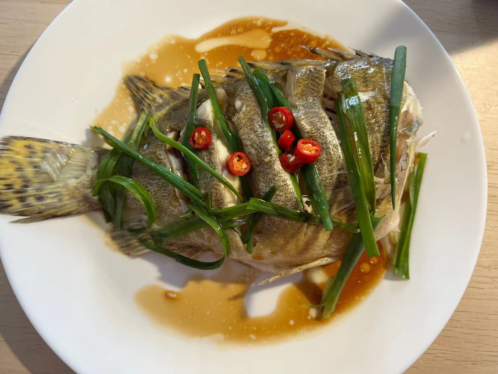
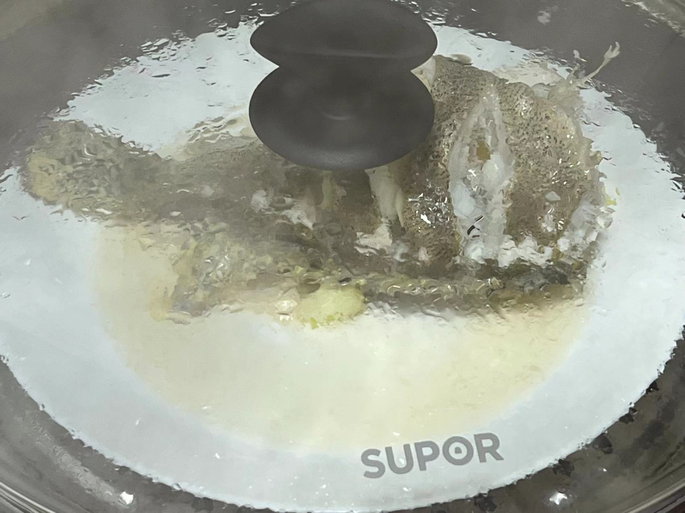

### 耗时: 
30min 处理

10min 蒸+浇油

### 时间
2023.3.18 桂花鱼 ￥75 （蛇口沃尔玛￥69.8/斤）
2023.3.12 海南老虎斑 ￥99/条 
2023.3.4 

### 材料
1. 桂花鱼：盒马活鱼不到1斤，¥49.9/条。免费宰杀，但有时处理不干净
2. 大葱：葱白，7cm左右，切丝儿或段都行
3. 姜：5-6片，丝儿10个左右
4. 料酒：2-3勺
5. 玉米淀粉：入锅蒸之前，抹一点在鱼身两面
6. 小葱：2根，切5-10cm的葱丝（可以沿着葱生长的方向划开后，再叠在一起，卷起来，最后切成丝儿）
7. 小米辣：1根，切6个圈儿
8. 蒸鱼豉油：4勺（不够可吃时再加）

### 步骤
1. 把鱼再洗净，耗时25min（可直接干掉鱼头！）
2. 鱼身上擦干水分，两面各划三刀
3. 腌鱼（至少30min）：葱姜料酒先混和，手抓匀以释放葱姜味儿。塞进鱼身，鱼身下、鱼上也放点儿，给划开到的地方也塞进去，静置30min+。
4. 大勺加水，把蒸屉放上，盖盖子大火烧开。腌制好的鱼**先不要去葱姜**，给鱼身两面撒一点玉米淀粉，放在盘上。等水开后入锅。
5. 盖盖子，大火蒸`8min`，关火。等待`1min`后再揭盖子，将盘子里蒸出的汁儿全部倒掉，并把葱姜也捡了丢弃。鱼身上摆放小葱丝儿，小米辣，再加入蒸鱼豉油。

6. 烧油（平时炒菜的量），油热泼在鱼身上，上菜！
