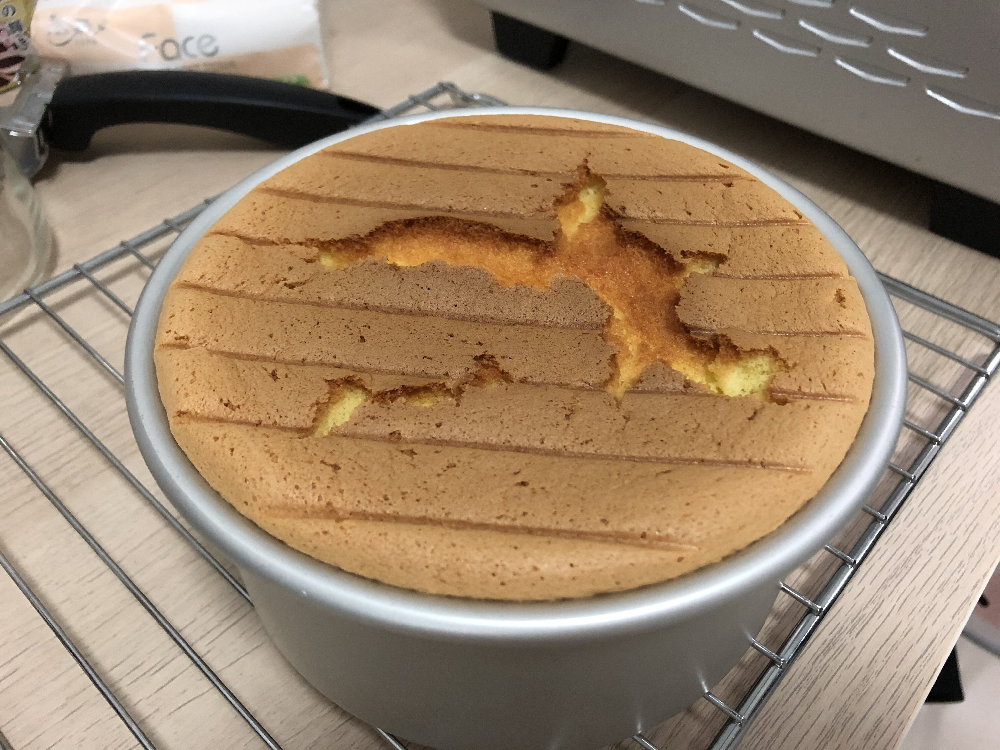
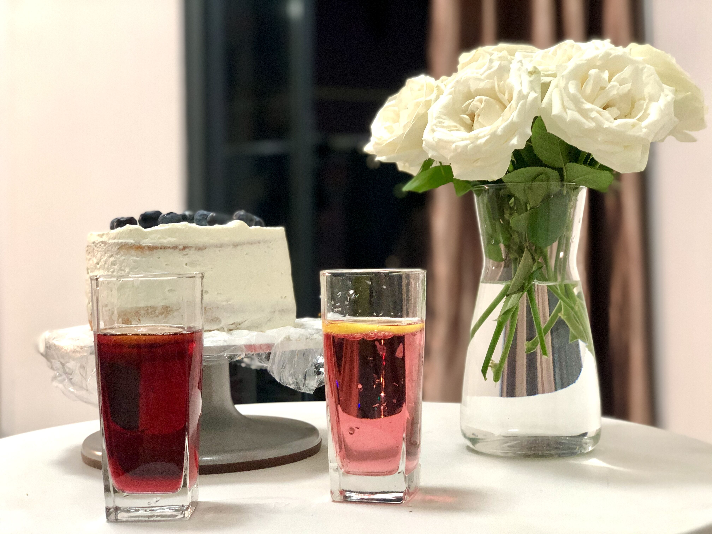

## 生日蛋糕

2020-12-27

### 耗时: 4h

准备: 40min(min=25min)  
烘烤: 40min  
晾凉: 1.5~2h  
抹奶油: 30min

### 时间
- 22，12.8
- 第21次  
  2021.11.7 周日 19:01 4蛋，蛋白霜混入了蛋黄虽然打发但是好像有点湿，其次面粉加多了应该66.8但实际77g，感觉没戏加速放入烤箱烤上了。上160偏低，下150偏低。
- 第20次(3蛋155°表面OK，腰OK，底部深坑)  
  2021.10.13 周三 早下班，台风天，给宝宝个惊喜。我也想吃蛋糕了。
- 第19次  
  2021.10.06 周三 11:30 这次口感不错，唯一缺陷在于上表面凸出模具太多导致扩散到外面了，另外底部大凹坑，直接吃还可以，无法抹奶油了
- 第18次  
  2021.10.05 周二 17:30 冷却后蛋糕表面塌了。。是否和看剧导致蛋白霜和蛋白糊混合不及时，另一半蛋白霜放置20min左右变稀了有关？
- 第17次
  2021.04.26 周一 20:32 明天下午启程开车回西安，路途遥远，备上蛋糕！
- 第16次
  这次没记，去三亚前一晚上做的，宝宝都没吃，不新鲜就不吃，这个家伙！
- 第15次  
  2021.04.09 周五 19:10 早下班，又想吃蛋糕了
2021.04.04 周日 20:15 明天去广州佛罗伦萨小镇买婚鞋带上吃（最终忘了。。）  
- 第14次  
  2021.03.07 周日 20:31 得用一波鸡蛋了，不然要过期。。
- 第13次 
  2021.02.xx 春节初二前的哪一天？
- 第12次  
  2021.01.31 周日 11:50 缺点不够蓬松
- 第11次  
  2020.12.27 周日 19:20 很棒！有史以来最好。
- 第10次  
  2020.12.24 周四 13:10 东非大裂谷。。
- 第9次  
  2020.12.19 周六 有史以来最好！
- 第8次  
  2020.11.11 周三 顶部东非大裂谷。。
- 第7次  
  2020.11.08 周六 底部略微凹陷，比较好了已经！
- 第6次  
  2020.10.31 周六 底部凹陷什么原因？再来！
- 第5次  
  2020.10.25 周日 上次空心了，再来！  
- 第4次  
  2020.10.17 周六 不信做不软！  
- 第3次  
  2020.08.23 周日 宝说晚上喝Rio，整个蛋糕吃  
- 第2次  
  2020.08.02 周日 pa下午睡醒宝想吃蛋糕了
- 第1次  
  还有一次初始，忘记了

### 每次记录
| No.| 大小      | 鸡蛋 | 牛奶 |玉米油|低筋面粉|玉米淀粉| 白砂糖|   温度     | 烤箱放置位置 | 烘烤时间      |   效果   |
|----| ----      |---- | ---- | ----| ----  |  ----  | ----  | ----      |   ----      |  ----        |   ----   |
| 1  | 6'        | 3个 | 37.5g| 30g  | 50g   | 5g    |   45g | 170°       |      中层   | 30min        | 硬，略焦 |
| 2  | 6'*`1.66` | 5个 | 62g  | 50g  | 83g   | 8.3g  |   74g | 170°->160° | 中层->中下层 | 30min+10min | 略软，上略焦 |
| 3  | 6'*`1.33` | 4个 | 50g  | 40g  | 66g   | 6.6g  |   60g | 165°       | 中下层(托盘`\__/`型) | 30min | 失败！蛋糕体空心。妈说可能下火大了。 |
| 4  | 6'*`1.33` | 4个 | 63g+  | 45g+  | 68g+   | 6.6g  |   60g |  165°    |  中下层(托盘`冖`型) | 30min | 上略焦，下凹坑，不够松软，蛋糕味道OK，奶油不甜。    |
| 5  | 6'*`1.33` | 4个 | 40*1.33=54g(↑) | 35*1.33=47g(↑) | 50*1.33=66g(-)   | 5*1.33=6.6g(-)  |   60*1.33=79.8g(↑) |  160°->155°->150°    |  中下层(**用托盘，不用网状**) | 35min | 上鼓起裂谷，下没看，直接吃了。。够软上下表面OK，但是芯偏生，可以多烤一会儿。味道可以再稍甜些。   |
| 6  | 6'*`1.33` | 4个 | 60g(↑) | 47g(-) | 67.3g(↑)   | 7g(↑)  |   96g(↑,20%) |  157°->下火150°(剩余10min时)    |  托盘，中下层 | 18:23~ 35min |   |
| 7  | 6'*`1.33` | 4个 | 71g(↑) | 49g(↑) | <i style='color:red'>61.7g(↓)</i>   | 7g(↑)  |   96g(↑,20%) |  157°, +13min 上下150°, +24min 上下140°，因为裂了    |  托盘，中下层 | 21:00~ 42min |   |
| 8  | 6'*`1.33` | 4个 | 61.4g(↑) | 51.5g(↑) | 67.3g(↑)   | 7g(↑)  |   96g(↑,20%) |  温度计157°烤30min，转150°烤10min出炉    |  托盘，中下层 | 20:23~ 40min |   |
| 9  | 6'*`1.33` | 4个 | 61.3g(↑) | 50.3g(↑) | 67.4g(↑)   | 7g(↑)  |   96g(↑,20%) |  温度计157放进去，150烤得，不好！不准，反应慢    |  托盘，中下层 | 13:10~ 40min |   |
| 10  | 6'*`1.33` | 4个 | 60g(↑) | 47.4g(↑) | 66.8g(↑)   | 7.5g(↑)  |   96.3g(↑,20%) |  旋钮指针157附近，30min后切150，再10min出锅    |  托盘，中下层 | 19:52~ 40min |   |
| 11  | 6'*`1.33` | 4个 | 60g(↑) | 46.8g(↑) | 66.8g(↑)   | 7.6g(↑)  |   96.9g(↑,20%) |  -    |  托盘，中下层 | 12:31~ 40min |   |
| 12  | 6'*`1.33` | 4个 | 60.2g(↑) | 48.5g(↑) | 66.8g(↑)   | 7.5g  |   96g |  -    |  托盘，中下层 | 17:16~ 40min |   |
| 13  | 6'*`1.33` | 4个 | 63.5g | 48.8g | 70g(↑)   | 7.5g  |   96g |  -    |  托盘，中下层 | 21:26~ 40min |   |
| 14  | 6'*`1.33` | 4个 | 61.6g | 48g | 68g   | 7.5g  |   96g |  -    |  托盘，中下层 | 20:15~ 40min |   |
| 15  | 6'*`1.33` | 4个 | 63.6g(↑) | 50g(↑) | 68g   | 7.5g  |   100g(↑) |  -    |  托盘，中下层 | 19:42~ 40min |   |
| 16  | 6'*`1.33` | 4个 | 63.6g(↑) | 50g(↑) | 68g   | 7.5g  |   100g(↑) |  -    |  托盘，中下层 | 21:20~ 40min |   |

> 带`+`的表示比实际称量的比标准多一些。

### 材料(6'蛋糕)
#### 3个鸡蛋
1. 鸡蛋3个
2. 牛奶40g 50 53
3. 玉米油35g 40 35
4. 低筋面粉50g 60
5. 玉米淀粉5g 6
6. 白砂糖60g 63

#### 4个鸡蛋
1. 鸡蛋 `4个`
2. 白砂糖(越细越好) `96g`
3. 玉米淀粉 `7.5g`
4. 牛奶 `60g`
5. 玉米油 `48g`
6. 低筋面粉 `66.8g`

#### 6个鸡蛋
1. 鸡蛋 `6个`
2. 白砂糖(越细越好) `144g`
3. 玉米淀粉 `11g`
4. 牛奶 `90g`
5. 玉米油 `72g`
6. 低筋面粉 `100g`

### 步骤
1. 分离蛋清、蛋黄  
   分离蛋黄和蛋白各放入一个打蛋盆中(**一定要分离干净，否则打不发**)，蛋黄分离好后，直接把`60g牛奶`、`48玉米油`加进去静置；
2. 打发蛋白霜  
   先低速后高速，白砂糖分3~4次加入，最后一次加糖时，也把`7.5g玉米淀粉`倒入，低速打至糖融化起**尖勾**  
  2.1 第一次打发后，可加入`第一次白砂糖32g`  
  2.2 再次打发到起**尖勾**后加入`第二次白砂糖32g`  
  2.3 再次打发到起**尖勾**后加入`第三次白砂糖32g`，这次把`7.5g玉米淀粉`也一起加入  
  2.4 再次打发到起**尖勾**后停止（**注意！蛋白霜打好后，不要静置超过15min，每隔一会儿要检查下，让它恢复刚打完的效果！**）
3. 打蛋黄糊  
   加入`66.8g低筋面粉`，打至均匀起**粘性**，不要太黏
4. 预热烤箱  
   `157°`，`10min`  
5. 混合蛋黄和蛋白  
   先加**一半**`蛋白霜`到`蛋白糊`，再把混合好的蛋糕糊，倒入另外一边的`蛋白霜`，**翻搅**均匀(呈Z字型，或者翻，而不要打圈儿)
6. 烘烤  
   举起打蛋盆距离桌面垂直高度20cm左右，缓慢将`蛋糕糊`倒入模具  
   模具抬起摔倒桌子上以震出气泡(就是不要有气泡，有的话用牙签啥的戳一下)  
   157°中下层，上下火30min；而后转下火温度至`150°`烘烤10min，便可出锅。  
   上次尝试：上火157°，下火163°，30min；最后10min转下火160。
7. 冷却  
   拿出来带着模具**震几下**，而后立马倒扣静置放凉
8. 打奶油  
   **事先冷藏奶油，才好打发**，打发奶油时可加一点细砂糖，按自己口味加就行，可以直接尝的。  
   :warning:**千万不敢打过了，否则成豆腐渣了，抹蛋糕的时候就不细腻光滑了**
9. 蛋糕脱模  
   正面伸手从蛋糕边缘进入，令其从模具壁上脱离，而后反过来从底部推压令其脱模。逐步重复上述两个步骤以脱下。 
10. 抹奶油  
   转盘裱花袋搞起来，给蛋糕抹奶油。

### 重要
1. 蛋白霜静置不要太久，要加速手头工作，尽可能在细腻的状态下和蛋黄糊混合（可以在混合前，手动搅拌重回细腻）；
2. 烘烤时，不要用带网的，要用托盘的（否则网的那种，底部温度过高）；
3. 动态调温：看隆起高度差不多，适当降低底火
4. 

### 第一次反馈建议
1. 蛋糕不够松软

### 第二次反馈建议
1. 这次整5个鸡蛋的量(*1.66)
2. 蛋黄和面粉要翻搅，而不要打圈
3. 烤箱温度由`170`降到`160`，烤`30min`
4. *这次5个蛋上拱得有点多，导致侧面`160°`之下没有熟，故又加了10min*
5. *而且中途发现`网格`放在`中层`的话，实际上蛋糕是偏上的，所以就把`网格`改放在`中层偏下`，这样蛋糕的位置差不多居中*

1. 这次很软！！
2. 晾凉后，底部总是有个大坑
3. 蛋糕上面一层烤过了，焦了
4. 淡奶油从冰箱拿出来才发现过期了，变质，于是干吃蛋糕！
5. *建议下次：`4个蛋，165°中下层放置烤30min`*

### 第三次反馈建议
1. 这次打蛋黄的时候，蛋白静置着。完了发现蛋白用铲子一铲，怎么感觉松散得一块一块，明显感觉内里很轻有空气。想起那个台湾女说补救一下，再打成最开始那种状态。OK，我提起打蛋器就开始整，还没打了1min发现丫怎么变稀了。。遂赶紧停手百度，说啥都有妈的不靠谱。自己决定不打了，虽然有点稀但是还有点尖角，但是蛋白很快就顺着向下流到盆里。就这么吃吧，只能自己总结经验了！到底什么才是打发？我这个状态是快到打发了，还是说应该继续打呢？
2. 失败！颜色OK，但蛋糕体空心，都集中在上面厚厚一层了，不发。怀疑是最后蛋白又多打了一次导致。故*不该多打蛋白*、*应直接给蛋黄上打蛋器*。
3. 蛋糕不够香，甜度稍低，`下次可多加10%的糖`。

### 第四次反馈建议
1. 正常蛋白打发（每1min低速后加一波糖，正常流程），但最后蛋白打发后不再管了，和以前一样。
2. 看了**甜悦**在[下厨房-戚风蛋糕](http://www.xiachufang.com/recipe/100445983/)的[视频](https://v.qq.com/x/search/?q=Tinrry%2B+%E6%88%9A%E9%A3%8E%E8%9B%8B%E7%B3%95&stag=0&smartbox_ab=)，发现若蛋白静置后状态有变(变为像豆腐块的松散状)，则在最后需要和蛋黄糊混合时，手动再打回原比较细腻的状态，而后再与蛋白糊混合搅拌。否则蛋糕可能出现"**收腰**"的情况。
3. 打蛋黄：2min低速1挡+1min中速3挡+1min高速5挡，打蛋器画圆缓慢边转边打。
4. 烘烤时蛋糕鼓起是正常现象，出炉后冷却会自动回落。
5. 上鼓起，是否鼓起后动态降低上方温度？
6. 下凹坑，导致蛋糕中心区域较厚，糕体压缩在一起从而导致口感不松软；而边缘厚度正常，吃起来较为松软，如何克服下凹坑导致的不够松软问题？

### 第五次反馈建议
1. 直接吃了，可再甜点儿，155°多烤一会儿，因为上下表面OK但是芯偏生了（虽然熟了）；
2. 芯有地方可见蛋黄偏硬，可以把蛋黄使劲搞均匀试试。

### 第六次反馈建议
1. 调整降低底火时间；由最后10min，改为最后15min时，降低至155°;
2. 上火也可同时降低一点（或隆起时就降低），至155°；
3. 这次已经相当好了！期待下次媳妇生日的表现。

### 第七次反馈建议
1. 面粉少6g
2. 东非大裂谷。。已经157度了啊，13min就裂，降到155，24min裂得大，鼓得高，直接140烤40min
3. **奶油有点稀，打得不够，应该继续打！！**
4. **严格按第六次做试试**。

### 第八次反馈建议
1. 烤得还不错，没有隆起很高
20:23 读数165°（而烤箱温度旋钮已经下调至140°！）放入蛋糕磨具开始烘烤
+10min, 这次没有鼓起，观察温度正好157°，旋钮位置近似于160°；
+30min, 降低温度至大约152°
+40min，出炉。略微隆起，有裂痕但是不大，看起来不错。
2. 冷却1h后，看到表面也没有塌陷很多，只有略微凹下去，但是几乎是做蛋糕以来最好的一次表面状态了。

### 第九次反馈建议
0. 估计是我容器预热的缘故，直接把蛋糕糊导入了还比较热的容器中，虽然烤箱温度和上次一样。
1. 放入时158°（烤箱温度指示157附近），但2min左右降到151°
2. +10min 没鼓，微微隆起，离边缘还有2cm，指针一直在150°，反复调节了旋钮反应很慢都不动！
3. +14min 超出容器一点
4. +18min 开始有裂痕了，温度计显示152°垃圾。上下旋钮现都降到140°
5. +22min 完了，东非大裂谷的趋势，估计是开始温度太高？当前温度计143°，旋钮145附近
6. +37min 实话说22min一看到这走势，我就放弃了！当前温度计150°（因为放弃治疗，烤熟就行）
7. +45min 出锅吧，反正应该能吃。。

### 第十次反馈建议
0. 温度计是个大傻叉！反应跟水獭有的一拼，不要再相信它！！
1. 将烤箱上下火温度指针拧到介于150~160之间，稍微偏向160，预热10min；
2. 放入模具时大约157度左右，烤30min；而后下调烤箱上下火温度指针，均调整指向150，烤10min；
3. 放入模具前，将模具拿起15~25cm高度摔3下，以震出大气泡；而后再用牙签优先将浮上表面的大气泡戳破；
4. 戳得差不多后，等上1min的样子，观察表面气泡，都是很小的而且密度不大，就可以放进去了；
5. **蛋黄在打的时候，使劲打不要担心打坏，不然有块状没打开黏在一起影响口感**；
6. **蛋白和蛋黄混合成蛋黄糊时，可以稍微多搅拌一些时间，尽可能打掉里面可能存在的团状糊糊**；
7. 蛋白放置时间不要太长，本次打好后到与蛋黄混合，大约放置了6min，这家伙精贵，隔一会儿就可以用铲子搅一搅再拌均匀，保证与蛋黄混合时，它是有光泽、细腻的；
8. 这次很好！缺点：
  1. 底部凹坑，倒是不深，大约1cm的样子
  2. 奶油不敢打过了！搅两下就可以倒入白砂糖了，避免打好了才加糖
  3. 蛋糕胚可以横着切两刀，分三层，中间夹心两层涂奶油，厚一点好看，侧边就不用涂奶油了，最上层表面奶油不要太厚啦！

### 第十一次反馈建议
0. 157°预热10min，放入蛋糕烤30min而后转150°10min出，烤18min时略微鼓起，26min时略微裂开，很完美！

### 第十二次反馈建议
1. 好像还是有坑

### 第十三次反馈建议
1. 口感ok，有坑，内里不够松软，怎么能做到里面非常疏松呢？

### 第十四次反馈建议
挺好，底部没坑。这次速度最快，25min就放到烤箱里了。。烤出来直接吃。

## Q&A

1、表面塌陷

- a. 底火不够，试试令底火比上火高10°
- b. 进了大气泡，入烤箱前震震
- c. 出烤箱后，先震震，再倒扣晾凉

2、表面鼓起裂开

- a. 如果鼓起的很多，可减少材料的量，6寸用3个蛋试试，令模具填充7成蛋糕面糊即可
- 