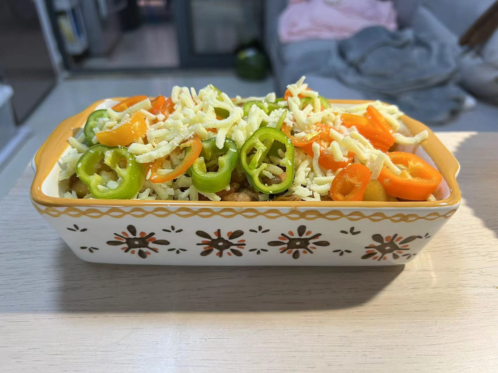
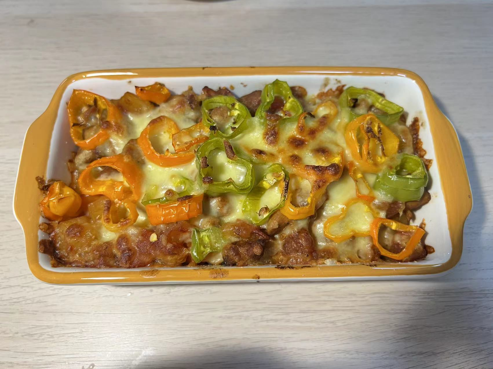

## 番茄鸡肉焗饭
★★★★★

---
### 次数
最近一次：2022.10.29
2

### 反馈建议
1. 有点糊（试试烤24min）
2. 有点咸（少放点盐）
3. 孜然味不浓，孜然粒都没有入味（孜然粒磨碎后，也参与腌制）
4. 少点儿甜（增加蜂蜜！）
5. 芝士如果糊了，可能香味出不来
6. 米饭不应该太湿

### 材料
1. 鸡腿2个
2. 西红柿2个
3. 小土豆1个
4. 胡萝卜半个
5. 洋葱1/4
6. 青红椒3小只

### 步骤
1. 鸡腿切丁，1勺黑胡椒粉、半勺酱油、半勺料酒，腌制（随便时间）
2. 洋葱切丝，番茄、胡萝卜、小土豆切丁
3. 油热，炒洋葱，炒鸡肉，炒胡萝卜土豆，炒番茄。一勺酱油、一勺番茄酱、2小碗水，焖煮
4. 烤碗中加入一勺半米饭，放入刚煮的番茄、鸡肉，放一层芝士（多点好吃），放青红椒，再放一层芝士
5. 烤箱**中下层**，下200°、上190°，15min

