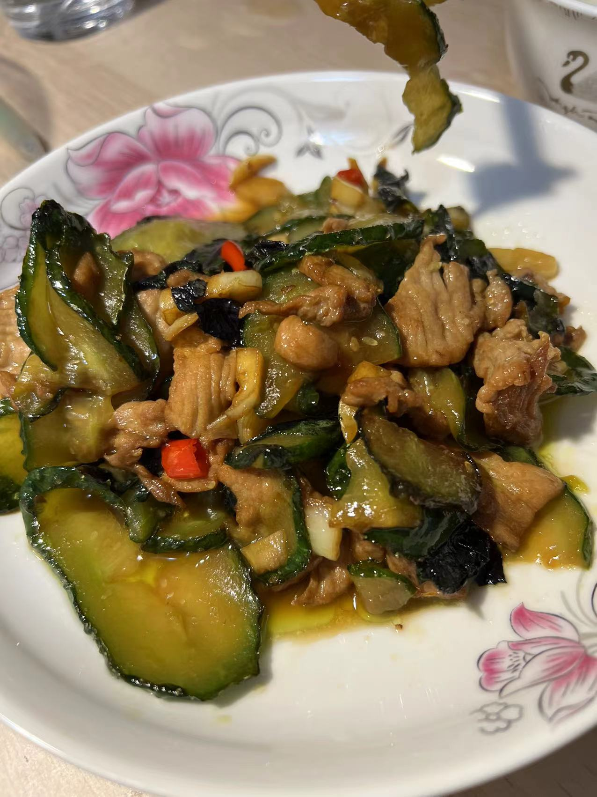

### 评级：☆☆☆

### 耗时: 

### 时间 
2023.3.6 第一次做，老婆喜欢吃蛮霸那家的，自己第一次尝试还挺好吃。

### 材料
1. sam黑猪里脊 100g
2. 
3. 胡萝卜1段切丝
4. 尖椒一只切丝
5. 木耳半盒切丝
6. 姜5片
7. 葱白一段、大蒜3瓣
8. 酱汁：白醋3勺、香醋3勺、白砂糖4勺（调料勺）、生抽3勺、清水3勺
9. 淀粉水：淀粉2瓷勺

### 步骤
1. 肉切丝，1勺酱油，1勺料酒，淀粉，老抽一点点，姜片腌肉
2. 腌好的肉炒变色捞出
3. 一点油，下胡萝卜炒一小会（10s-20s）
4. 一满满勺豆瓣酱，葱蒜炒香
5. 下尖椒莴笋木耳炒断生，
6. 倒入酱汁，倒入淀粉水，大火变惆，尝一尝缺不缺糖，出锅

### 关键点
1. ~~~~