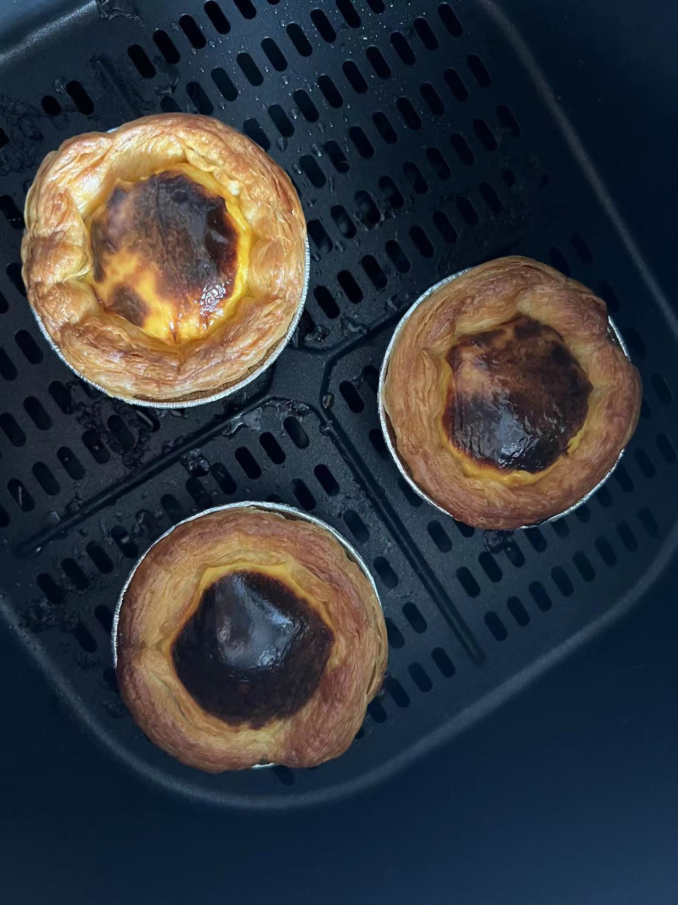
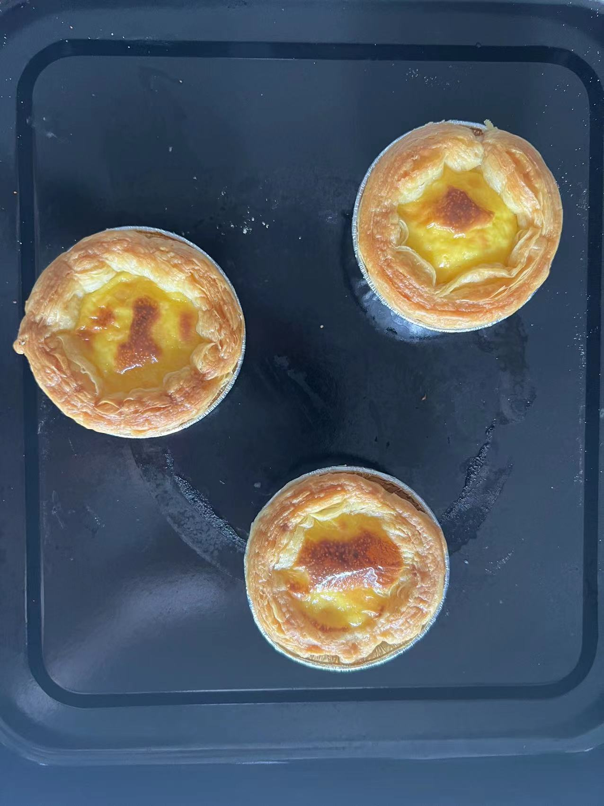

## 蛋挞

### 耗时: 30min

### 做了多少次
首次：2022.06.12 Sun  
最近一次：2022.06.12 Sun  
总计：+1 

### 材料（5-6个蛋挞）
蛋挞皮：
1. 网上买，西厨贝可葡式蛋挞皮36个装（23g*36个）￥35.8

蛋挞液（自己做，也可网上买）：
1. 鸡蛋1个
2. 淡奶油50g
3. 牛奶40g
4. 细砂糖8g
5. 低筋面粉5g

### 步骤
1. 制作蛋挞液  
   1.1 空盆倒入`牛奶40g`、`淡奶油50g`、`细砂糖8g`，搅匀（可用手动打蛋器）使白砂糖溶解就好（也可让盆坐在热水中加速溶解）；  
   1.2 鸡蛋`只要蛋黄`，加入盆中，再**过筛**加入`5g低筋面粉`，搅匀至没有小颗粒；
2. 烘烤  
   蛋挞液倒入蛋挞杯7-8分满即可  
   2.1 空气炸锅：195度12min  
   2.2 烤箱：190度**中层**上下火25min

### Q&A
1. 第一次  
媳妇说10g糖还是甜了（原作者配方要20g糖。。底下都反馈太甜）。  
空气炸锅200度12min，表皮焦了

烤箱190度中下层30min，还是偏轻了

2. 