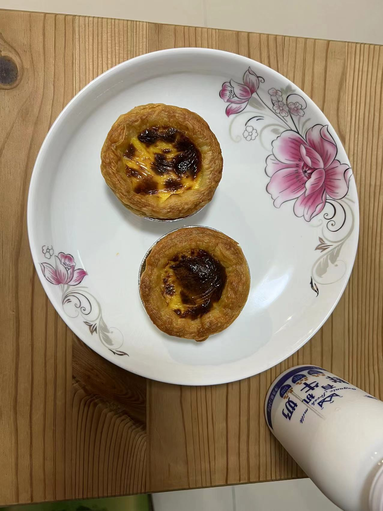
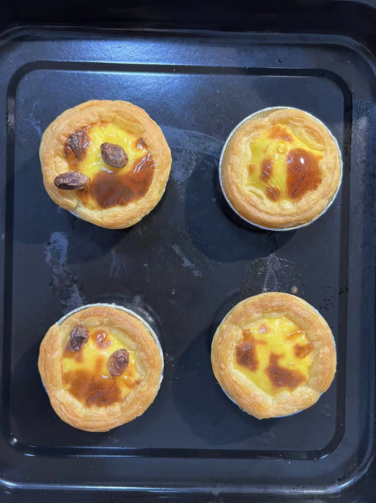

## 蛋挞

### 耗时: 30min

### 做了多少次
第四次：2022.7.20 Wed
第三次：2022.6.29 Wed
第二次：2022.6.12 Sun
第一次：2022.6.12 Sun

### 材料（5-6个蛋挞）
蛋挞皮：
1. 网上买，西厨贝可葡式蛋挞皮36个装（23g*36个）￥35.8

蛋挞液（自己做，也可网上买）：
1. 鸡蛋1个 2
2. 淡奶油50g 83
3. 牛奶40g 82
4. 细砂糖7g 14
5. 低筋面粉5g 10

### 步骤
1. 制作蛋挞液  
   1.1 空盆倒入`牛奶`、`淡奶油`、`细砂糖`，搅匀（可用手动打蛋器）使白砂糖溶解就好（也可让盆坐在热水中加速溶解）；  
   1.2 鸡蛋`只要蛋黄`，加入盆中，再**过筛**加入`低筋面粉`，搅匀至没有小颗粒；
2. 烘烤  
   蛋挞液倒入蛋挞杯7-8分满即可  
   2.1 空气炸锅：190度12min或185度16min  
   2.2 烤箱：190度**中层**上下火22min

### Q&A
1. 第一次  
媳妇说10g糖还是甜了（原作者配方要20g糖。。底下都反馈太甜）。  
空气炸锅200度12min，表皮焦了

烤箱190度中下层30min，还是偏轻了

2. 第二次  
媳妇说8g还是甜。  
空气炸锅190 12min，还是略焦（但老婆喜欢）  
  
烤箱190度中层上下火，22min挺好。我喜欢这个程度。  
