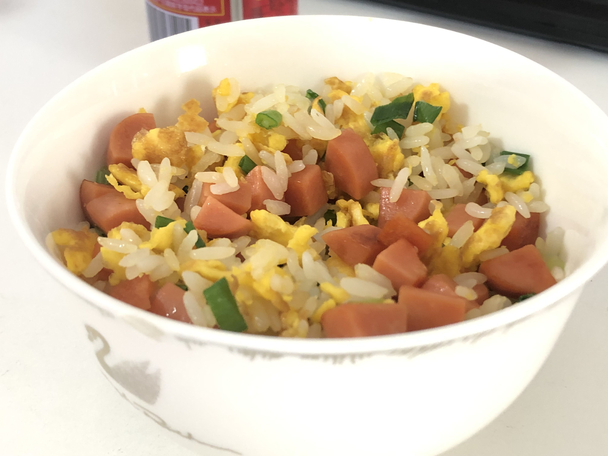

## 蛋炒饭

### 评级：☆☆☆☆

### 耗时: 20min

### 时间
2021.09.25 周六

### 材料
1. 剩米饭
2. 火腿肠 x 4 切成粒
3. 鸡蛋 x 4
4. 小葱切成小段

### 步骤
1. 热锅冷油中大火，放入鸡蛋打散
2. 倒入米饭，用铲子压扁，尽可能把一块块的米饭团分开，目标是搞成一粒粒的
3. 米饭炒得稍干后（大约1.5min吧），加`多半勺盐`拌匀
4. 倒入`火腿肠`，如果感觉略干的话，`再少加一点油`
5. 不断翻炒，出锅前`加葱`、`一点鸡精/味精`，拌匀出锅！

### 关键点
1. 米饭压扁分粒；
2. 控制油，中途加一点点儿就够了；
3. **没出锅时品尝，会以为没味**，要加盐也是**每次少加盐，小步尝试**；
