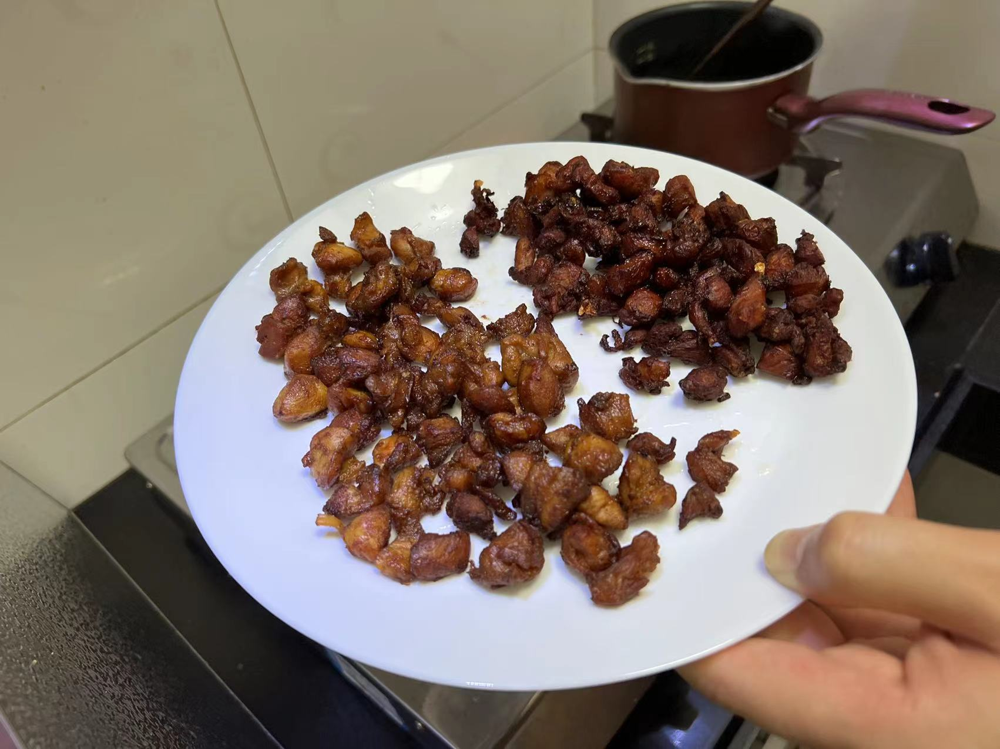

## 辣子鸡

### 耗时: 1h
- 准备：30min
- 炸鸡丁：10min
- 炒：12min

### 做了多少次
首次：?  
总计：+6
No.6 2022.07.31 周日，12个鸡腿 21:43每次都是深夜食堂
No.5 2022.06.26 周日，12个鸡腿
No.4 2022.06.03 端午第一天  

> **注意：以下是6只鸡腿的配方。**
### 6个鸡腿的材料
1. 鸡腿6个（盒马，一盒3只10元。6只试过，不够吃。。）
2. 干辣椒不辣5包，辣2/3包
3. 大蒜5瓣
4. 红花椒2/3小碗（调料碗）（爸单位发的"双峪岭"好吃）
5. 青花椒：红花椒 = 1 : 3

### 12个鸡腿的材料
1. 鸡腿12个
2. 干辣椒不辣 150g，辣 30g
3. 大蒜10瓣
4. 红花椒 70g（圆的一小碗是40g）
5. 青花椒 15g
6. 盐 3勺
7. 绵白糖 8满勺

### 步骤
腌制准备：
1. 鸡肉切丁，2勺酱油，1勺料酒，1勺蚝油，5片姜，1大勺十三香，抓匀，**腌制一晚以上**

炸鸡丁（6个鸡腿要炸分2次炸）：
1. 小奶锅热油，放葵花籽油大概100-300ml吧，有点深度让鸡肉丁能漂起来就行
2. 别等油很热了再放鸡腿，油温上来点儿就可以放了，鸡腿肉全部入锅
3. 中火炸10min，中途用筷子拨一拨，炸均匀（颜色焦黄外表稍微炸焦但一定要避免整体过焦发黑，不要太过，偏黑色的话肉里面就有点硬了）。以下图两者之间为佳（比左边偏焦、右边偏轻的就不错）。

炒鸡丁：
1. 热锅冷油放入：蒜瓣儿、红花椒、青花椒，炒香；
2. 将所有干辣椒倒入翻炒，**一定要小火**（<b style='color: red'>再次强调，必须小火！</b>，以最终辣子炒出来仍然是偏红色而不是黑色为最佳实践），翻炒大约5分钟。因为大火容易让辣椒糊导致苦，要有耐心；
3. 倒入鸡丁，**保持小火**继续翻炒5分钟，加料：1勺盐、2勺绵白糖，再炒2min就可以出锅

### 关键点
1. 炸鸡丁要"过而不焦"，炸轻了太软没口感，炸太过了过硬过焦偏苦。
2. 自辣子入锅后，必须全程小火；